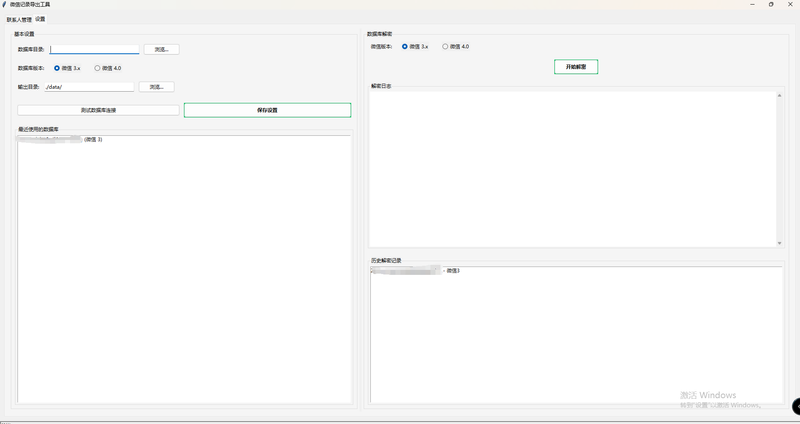

# WeChatMsg GUI

这是一个基于原始留痕(MemoTrace)项目（https://github.com/LC044/WeChatMsg）二次开发的微信记录导出工具，提供了全新的图形用户界面(GUI)，使微信聊天记录的导出操作变得更加简单直观。

## 预览


*设置与数据库解密*


*联系人管理与聊天记录导出*


## 项目特点

- **多功能导出**：支持多种导出格式（HTML、TXT、DOCX、MARKDOWN、XLSX等）
- **联系人管理**：可视化的联系人列表，支持搜索和筛选
- **数据库解密**：内置微信3.x和4.0版本数据库解密功能
- **批量操作**：支持批量导出多个联系人的聊天记录
- **自定义选项**：可选择导出的消息类型和时间范围

## 系统要求

- Windows操作系统（Windows 10或更高版本）
- Python 3.7或更高版本
- 已安装并登录的微信客户端

## 安装步骤

### 方法一（暂未打包）：直接下载可执行文件

<!-- 1. 从项目发布页下载最新的可执行文件 -->
<!-- 2. 解压后双击运行`WeChatExporter.exe` -->

### 方法二：从源码安装

1. 克隆项目代码：
   ```
   git clone https://github.com/LC044/WeChatMsg.git
   cd WeChatMsg
   ```

2. 安装依赖：
   ```
   pip install -r requirements.txt
   ```
   
   或使用批处理文件：
   ```
   install.bat
   ```

3. 运行程序：
   ```
   python run_wechat_export.py
   ```

## 使用方法

### 1. 数据库解密

1. 在"设置"选项卡中，选择微信版本（3.x或4.0）
2. 指定微信数据库目录（如不确定，可点击"测试连接"自动查找）
3. 点击"解密微信数据库"按钮

### 2. 联系人管理

1. 解密成功后，切换到主界面
2. 点击"加载联系人"按钮
3. 使用搜索框查找特定联系人
4. 点击联系人查看详细信息

### 3. 导出聊天记录

1. 选择需要导出记录的联系人
2. 设置输出目录和导出格式
3. 可选择消息类型和时间范围
4. 点击"开始导出"按钮
5. 等待导出完成，查看结果

## 常见问题

### 解密失败
- 确保微信已登录并正常运行
- 关闭微信后重新尝试
- 检查是否选择了正确的微信版本

### 联系人加载失败
- 确保数据库解密成功
- 检查数据库文件是否存在
- 尝试重新解密数据库

### 导出过程中出错
- 检查输出目录是否有写入权限
- 确保微信客户端没有锁定相关文件
- 查看日志区域的错误信息


## 技术支持

如遇问题，请通过以下方式获取帮助：
- 查看日志区域的错误信息
- 在项目Issues页面提交问题
- 参考原始MemoTrace项目的文档

## 作者与贡献者

### 主要贡献者
- [Xyy-tj] - GUI界面重构与功能

### 原始项目贡献者
- [LC044](https://github.com/LC044) - 原始MemoTrace (WeChatMsg)项目作者
- 原项目所有贡献者的努力与支持

## 如何贡献

欢迎为本项目做出贡献！您可以通过以下方式参与：

1. Fork本仓库
2. 创建您的特性分支 (`git checkout -b feature/amazing-feature`)
3. 提交您的更改 (`git commit -m 'Add some amazing feature'`)
4. 推送到分支 (`git push origin feature/amazing-feature`)
5. 开启一个Pull Request

## 免责声明

本工具仅用于个人数据备份，请勿用于非法用途。使用本工具导出的聊天记录应当遵守相关法律法规，不得侵犯他人隐私。

## 许可证

本项目遵循与原始MemoTrace项目相同的许可证。详情请参见[LICENSE](LICENSE)文件。

## 致谢

特别感谢[原始MemoTrace项目](https://github.com/LC044/WeChatMsg)的开发者提供的基础代码和功能支持。本项目在其基础上开发了更直观的用户界面和额外功能。
